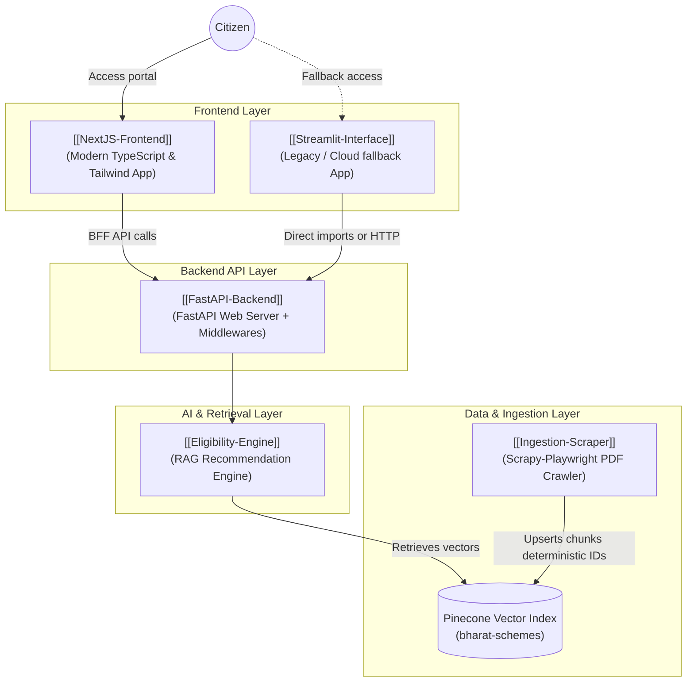

# S.A.R.A.L. Project Brain

Welcome to the **S.A.R.A.L. (Scheme Access, Retrieval, Analysis & Layer)** Project Brain. This is a connected knowledge vault designed to reconstruct the mental model of the senior engineers who designed and evolved S.A.R.A.L. into a production-grade Indian GovTech recommendation and chat platform.

---

## 1. Project Identity

* **The Problem:** Government welfare schemes in India are described in dense, state-specific PDF manuals. Finding relevant schemes and verifying eligibility is complex, leading to low citizen adoption.
* **The Solution:** S.A.R.A.L. serves as an AI assistant that extracts scheme guidelines, pre-filters schemes by state residency, and matches user demographics against strict eligibility limits (age, caste, occupation, income) using a high-fidelity **Retrieval-Augmented Generation (RAG)** pipeline.
* **Primary Target Users:** Indian citizens looking for scheme matches, local developers testing GovTech solutions, and administrators monitoring the crawling and database statistics.
* **Key Constraints:**
  * **Location Boundary Guard:** Do not suggest state-specific schemes to citizens of other states.
  * **Context Size Limits:** Minimize LLM costs by pre-filtering candidates and ranking top candidates before LLM ingestion.
  * **Brittle Data Inputs:** Keep LLM responses structured (strict JSON arrays) even when the user asks free-text follow-ups.

---

## 2. Current Architecture & Core Components

S.A.R.A.L. is structured as a decoupled web application with the following key components:

### Core Architecture Notes:
* **[[System-Overview]]**: High-level overview of the system, data flows, and dual execution topologies.
* **[[NextJS-Frontend]]**: The primary modern TypeScript web UI with Tailwind CSS and Framer Motion.
* **[[Streamlit-Interface]]**: Legacy UI which is retained for backward-compatible Streamlit Cloud deployment.
* **[[FastAPI-Backend]]**: API router containing chat, schemes, and admin stats endpoints, rate-limiting, and Redis caching.
* **[[Ingestion-Scraper]]**: Automated web crawler that processes PDFs/web portals and registers items idempotently.
* **[[Eligibility-Engine]]**: Core RAG pipeline with parallel retrieval, a critic evaluation loop, and re-ranking.

---

## 3. Core Concepts

* **[[RAG-Retrieval-Augmented-Generation]]**: Overarching retrieval concept, chunking, and embedding with local `all-MiniLM-L6-v2`.
* **[[Researcher-Critic-Relevance-Loop]]**: Agentic feedback cycle that evaluates snippet relevance and refines vector query strings.
* **[[MiniLM-Candidate-Reranking]]**: Cosine similarity filter ranking top candidates to minimize LLM prompt size.
* **[[Idempotent-Data-Ingestion]]**: Prevent index duplication by verifying content hashes in local SQLite stores.
* **[[Near-Miss-Eligibility]]**: Logical flow recommending schemes where the user fails exactly one eligibility parameter.

---

## 4. Architecture Evolution & The Timeline

S.A.R.A.L. evolved from a single-file Streamlit script processing static files locally into a modern, decoupled web application running an automated data ingestion pipeline.

* **Detailed Timeline:** See **[[Project-Timeline]]** for a chronological review of commit history, feature integrations, and production patches.
* **Core Eras:**
  1. *Core Foundation & RAG Bootstrap (Feb 17 - Feb 18, 2026)*: Initial dual-query retrieval RAG design.
  2. *Cloud Deployment Hardening (Feb 18 - Feb 19, 2026)*: Streamlit Cloud pathing fixes and hybrid config loaders.
  3. *CI/CD Hugging Face Space Sync (Feb 19, 2026)*: Syncing setup and divergent state resolutions.
  4. *Performance Polish & Retrieval Hardening (Feb 20 - Apr 19, 2026)*: Fixing brittle income retrieval and enforcing model determinism.
  5. *Phase 2 Data Pipelines & Scraper (Jun 26 - Jun 27, 2026)*: Automated Scrapy pipeline, Pinecone server-side metadata filtering, and candidate re-ranking.
  6. *Next.js Modern Frontend Migration (Jun 27 - Jun 28, 2026)*: Full UI rewrite, chat streaming, rate-limiting, and voice support.

---

## 5. Key Architectural Decisions

* **[[Direct-Service-Imports-Cloud-Mode]]**: Direct service imports in Streamlit `api_client.py` to bypass network hops when deployed in Streamlit Cloud.
* **[[Server-Side-Metadata-Filtering]]**: Pushing the state boundary checks into Pinecone metadata queries instead of filtering inside Python client code.
* **[[Force-LLM-Determinism]]**: Enforcing `temperature=0.0` for LLM engines to maintain strict JSON formats.
* **[[Clean-Slate-Push-HF-Spaces]]**: Designing a squashed, single-commit push workflow for Hugging Face Spaces deployments.
* **[[NextJS-Tailwind-Migration-Decision]]**: Rewrite of frontend in Next.js + TypeScript to support premium responsive UI design and streaming.
* **[[BFF-Proxy-Streaming-Chat-Decision]]**: Hiding FastAPI endpoints and API keys while streaming responses via Next.js Route Handlers.
* **[[Rate-Limiting-and-Cache-Hardening-Decision]]**: Hardening endpoints with fixed-window rate-limiting and a hybrid Redis recommendation cache.

---

## 6. Critical Incidents & Reconstructed Failures

* **[[Streamlit-Cloud-Import-Failure]]**: Import crashes on serverless Streamlit environment caused by differing execution working directories.
* **[[Hugging-Face-Spaces-Push-Failure]]**: CI failures caused by divergent branch history and file size limit blockers when pushing code to Hugging Face.
* **[[Brittle-Numeric-Vector-Search-Failure]]**: Semantic search degradation caused by injecting exact income digits into vector index lookups.

---

## 7. Major Lessons Learned

* **[[Dense-Embeddings-Numeric-Limitations]]**: Dense vector representations fail at mathematical comparison; numerical filters belong in metadata pre-filters and prompt heuristics.
* **[[Serverless-Monolithic-Hybrids]]**: Designing dual-mode configurations allows applications to work seamlessly in serverless (direct python imports) and distributed microservices (HTTP REST APIs) configurations.
* **[[CI-Divergent-State-Resolutions]]**: Auto-generating mirrors on third-party hosters (like Hugging Face Spaces) requires squashed, force-pushed histories to prevent divergent branch blockages.

---

## 8. Current Gaps & Unanswered Questions

* **[[Questions-for-Developer]]**: Active open questions regarding n8n hosting architectures, production Pinecone vector index settings, and Vercel hosting addresses.
* **[[Source-Evidence]]**: References mapping architectural claims to Git commit hashes.
