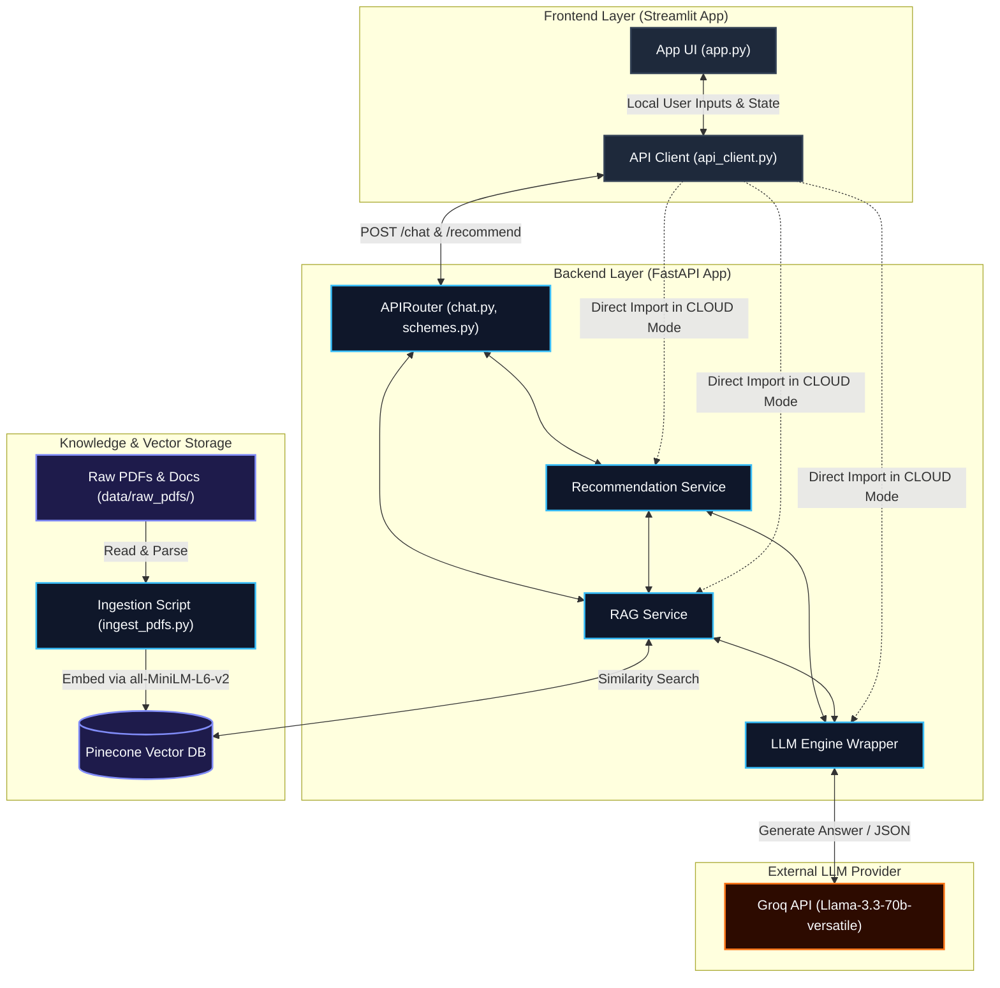

# S.A.R.A.L. Project Architecture

This document describes the high-level system architecture, data workflows, and folder structure of **S.A.R.A.L. (Scheme Access, Retrieval, Analysis & Layer)**.

---

## System Architecture Overview

S.A.R.A.L. is built as a modular AI-powered Indian Government Scheme recommendation and consultation platform. It uses a **Retrieval-Augmented Generation (RAG)** pipeline combined with strict business logic filtering and a multi-vector query approach.

The system is designed with dual-execution capability:
- **Local Mode**: Uses a decoupled REST API with a **FastAPI** backend and **Streamlit** frontend communicating over HTTP.
- **Cloud Mode (Monolithic)**: Streamlit imports the backend service layers directly to bypass HTTP overhead and facilitate serverless deployment.



---

## Detailed Workflows

### 1. Recommendation Retrieval & Analysis Pipeline

When a user submits their profile, the system executes a production-grade multi-vector retrieval process combined with strict metadata filtering and rules-based LLM analysis:

```mermaid
flowchart TD
    %% Styling
    classDef process fill:#1e293b,stroke:#334155,color:#f8fafc;
    classDef decision fill:#1e1b4b,stroke:#818cf8,color:#f8fafc;
    classDef start_end fill:#0f172a,stroke:#38bdf8,stroke-width:2px,color:#f8fafc;

    Start([User Requests Recommendation]) --> Inputs[Extract Profile: Age, State, Occupation, Income, Caste, Language]

    subgraph RetrievalStage ["1. Multi-Vector Retrieval Pipeline"]
        Inputs --> GenQueries[Generate 3 Parallel Queries:<br>A. Semantic Search<br>B. Keyword/State Search<br>C. Broad National Search]
        GenQueries --> PineconeSearch[Query Pinecone Index (k=10 to 15)]
        PineconeSearch --> MergeDedup[Merge & Deduplicate Chunks by first 200 chars]
    end

    subgraph FilterStage ["2. Strict Metadata Filter"]
        MergeDedup --> FilterDocs{Does State Match?<br>Doc State == User State OR<br>Doc State is Central/Union OR<br>Doc State is Empty}
        FilterDocs -->|No| Reject[Discard Document Chunk]
        FilterDocs -->|Yes| Keep[Keep Document Chunk]
    end

    subgraph AnalysisStage ["3. Eligibility Verdict Engine"]
        Keep --> PromptBuild[Construct Prompt:<br>Apply Strict Occupation Logic<br>Apply Strict Income Limits<br>Apply Caste Constraints]
        PromptBuild --> LLMCall[Call LLM: Groq Llama-3.3-70b]
        LLMCall --> JSONParse[Extract and Parse JSON Array]
        JSONParse --> SchemeDedup[Deduplicate Schemes by Base Name prefix]
        SchemeDedup --> LanguageTrans[Translate 'reason' field to Selected Language]
    end

    LanguageTrans --> End([Return Final Recommendation List])

    class Start,End start_end;
    class Inputs,GenQueries,PineconeSearch,MergeDedup,Keep,Reject,PromptBuild,LLMCall,JSONParse,SchemeDedup,LanguageTrans process;
    class FilterDocs decision;
```

- **Parallel Vector Retrieval**: Resolves issues with embeddings missing broad national queries by checking:
  1. *Semantic Query*: Evaluates descriptive details.
  2. *Keyword/State Query*: Targeted lookup matching the state name.
  3. *National Fallback*: Direct query for Central/National schemes (e.g. Pradhan Mantri schemes).
- **Metadata State Filtering**: Guarantees that users are not shown state-specific schemes from regions they do not reside in.
- **Strict Logic Guards**: Prompt rules strictly limit matching based on occupation (e.g. Students, Farmers, Business), caste categories, and income limits.

---

### 2. Document Ingestion Pipeline

The ingestion pipeline handles loading documents, extracting metadata, and splitting them for embedding extraction:

```mermaid
flowchart LR
    classDef step fill:#1e293b,stroke:#334155,color:#f8fafc;
    classDef start_end fill:#0f172a,stroke:#38bdf8,stroke-width:2px,color:#f8fafc;

    Start([Scan data/raw_pdfs/]) --> Walk[Recursively find PDF, CSV, JSON, TXT]
    Walk --> ForEach[For Each File]
    ForEach --> Loader[Load document contents based on Extension]
    Loader --> Meta[Smart Metadata Tagging:<br>Set 'state' = parent folder name<br>Set 'source_file' = file name]
    Meta --> Chunk[Split text using RecursiveCharacterTextSplitter<br>chunk_size=1000, overlap=200]
    Chunk --> Embed[Embed chunks with all-MiniLM-L6-v2]
    Embed --> Upsert[Upsert to Pinecone Vector Index]
    Upsert --> Next{More Files?}
    Next -->|Yes| ForEach
    Next -->|No| End([Ingestion Complete])

    class Start,End start_end;
    class Walk,ForEach,Loader,Meta,Chunk,Embed,Upsert step;
```



---

## Directory Structure

```
S.A.R.A.L/
├── backend/                      # The Intelligence Layer (Python/FastAPI)
│   ├── app/
│   │   ├── api/
│   │   │   ├── v1/
│   │   │   │   ├── chat.py           # Endpoints for chat streaming & history
│   │   │   │   └── schemes.py        # Endpoints for searching & recommending schemes
│   │   ├── core/
│   │   │   └── config.py             # Env variables & Pydantic Config settings
│   │   ├── models/
│   │   │   └── dtos.py               # Request/Response Data Transfer Objects (Pydantic)
│   │   ├── services/                 # core business logic
│   │   │   ├── llm_engine.py         # Groq LLM wrapper with custom prompts & history
│   │   │   ├── rag_retriever.py      # Pinecone query logic & query expansion (Documents)
│   │   │   └── recommendation.py     # Multi-vector search, state filtering, and verdict gen
│   │   └── main.py                   # FastAPI entrypoint
│   ├── scripts/                      # DB utilities and ingestion
│   │   ├── ingest_pdfs.py            # PDF metadata loader and parser
│   │   ├── reset_db.py               # Wipes Pinecone indexes
│   │   └── test_groq.py              # Groq connectivity checker
│   ├── requirements.txt              # Backend libraries
│   └── Dockerfile                    # Docker build configuration
│
├── frontend/                     # The User Layer (Streamlit App)
│   ├── src/
│   │   └── utils/
│   │       └── api_client.py         # Adapter to switch between Cloud (direct) & Local (HTTP) modes
│   └── app.py                        # Main UI and State Manager
│
├── n8n-workflows/                # The Automation Layer
│   ├── workflow_whatsapp.json        # Whatsapp service hooks
│   ├── workflow_email_check.json     # Email notification triggers
│   └── workflow_db_sync.json         # Direct Google Sheets to DB Synchronizer
│
├── data/                         # Core Knowledge Base
│   ├── raw_pdfs/                     # User-added PDFs and scheme guidelines
│   ├── processed/                    # Extracted scheme JSON files
│   └── templates/                    # Dynamic templates for auto-filled application forms
│
├── docs/                         # Extended API and Setup guidelines
│   ├── API_SPEC.md
│   └── DEPLOYMENT_GUIDE.md
│
├── .env.example                  # Template environment file
├── docker-compose.yml            # Docker Orchestration config
└── README.md                     # General project manual
```

---

## Technology Stack Breakdown

* **Frontend**: Streamlit using a custom Dark Theme with glassmorphism cards and layout scaling to handle mobile and desktop responsive views.
* **API Framework**: FastAPI, chosen for async support, automatic OpenAPI/Swagger documentation, and performance.
* **Vector Store**: Pinecone (Serverless index).
* **Embeddings**: `all-MiniLM-L6-v2` via HuggingFace (locally calculated to minimize latency).
* **Large Language Model (LLM)**: Groq Cloud API executing `llama-3.3-70b-versatile`.
* **Automations**: `n8n` workflows configured for user alerts via WhatsApp and email syncs.

---

## End-to-End Query-Response Workflow

Below is a detailed visual representation of the lifecycle of a query—from the moment a user submits an input or runs an eligibility check in the Streamlit UI, to the final rendering of processed, translated results.

```text
+-------------------------------------------------------------------------------------------------+
|                                     USER QUERY WORKFLOW                                         |
+-------------------------------------------------------------------------------------------------+
|                                                                                                 |
|   [ USER INPUT ]                                                                                |
|         │                                                                                       |
|         ▼                                                                                       |
|   +───────────────────────────────+                                                             |
|   │      Streamlit Frontend       │ (Inputs: Age, State, Occupation, Income, Caste, Query)       |
|   +───────────────┬───────────────+                                                             |
|                   │                                                                             |
|                   │ (LOCAL: HTTP POST / CLOUD: Direct Import)                                   |
|                   ▼                                                                             |
|   +───────────────────────────────+                                                             |
|   │     FastAPI Router / Client   │ (Routes /recommend or /chat request)                        |
|   +───────────────┬───────────────+                                                             |
|                   │                                                                             |
|                   ├──────────────────────────────────┐                                          |
|                   ▼ (A. Retrieve Context)            ▼ (B. Process Recommendation)              |
|   +───────────────────────────────+            +───────────────────────────────+                |
|   │          RAG Service          │            │    Recommendation Service     │                |
|   +───────────────┬───────────────+            +───────────────┬───────────────+                |
|                   │                                            │                                |
|                   │ 1. [Query Expansion]                       │ 1. [Multi-Vector Search]       |
|                   │    (Appends doc keywords)                  │    (Semantic + Keyword + Nat.) |
|                   │ 2. [Pinecone Query]                        │ 2. [Metadata State Filter]     |
|                   │                                            │    (Keeps User State/Central)  |
|                   ▼                                            │                                |
|         +───────────────────+                                  ▼                                |
|         │   Pinecone DB     │ <────────────────────────────────┘                                |
|         +─────────┬─────────+   (Fetches top-K document chunks)                                 |
|                   │                                                                             |
|                   │ (Retrieved Excerpts)                                                        |
|                   ▼                                                                             |
|   +───────────────────────────────+                                                             |
|   │       LLM Engine Wrapper      │ (Builds template with Context + Eligibility constraints)     |
|   +───────────────┬───────────────+                                                             |
|                   │                                                                             |
|                   │ (Custom System Prompt)                                                      |
|                   ▼                                                                             |
|         +───────────────────+                                                                   |
|         │  Groq Cloud API   │ (Llama-3.3-70b-versatile Model Execution)                             |
|         +─────────┬─────────+                                                                   |
|                   │                                                                             |
|                   │ (Raw Answer / JSON Verdict Array)                                           |
|                   ▼                                                                             |
|   +───────────────────────────────+                                                             |
|   │     Post-Processing Layer     │ 1. Extracts & Parses JSON Array                             |
|   │    (Recommendation.py)         │ 2. Deduplicates by Base Scheme Name                         |
|   │                               │ 3. Translates Verdict Reason to Selected Language           |
|   +───────────────┬───────────────+                                                             |
|                   │                                                                             |
|                   │ (Cleaned & Translated Result Payload)                                       |
|                   ▼                                                                             |
|   +───────────────────────────────+                                                             |
|   │       Streamlit Dashboard     │ (Renders Glassmorphic cards or streams Chat responses)      |
|   +───────────────┬───────────────+                                                             |
|                   │                                                                             |
|                   ▼                                                                             |
|   [ USER VIEW / RESULT ]                                                                        |
|                                                                                                 |
+-------------------------------------------------------------------------------------------------+
```

### Workflow Steps Breakdown:

1. **User Input Collection**: The user enters their demographic details (age, state, occupation, income, caste) and chooses a language. They either submit a chat query or request a scheme recommendation check.
2. **API Dispatching**: The frontend's `api_client.py` determines the execution environment:
   * *LOCAL*: Relays a JSON payload via HTTP POST to FastAPI's `/api/v1/chat` or `/api/v1/recommend`.
   * *CLOUD*: Imports the modules and passes the arguments directly in memory.
3. **Intelligent Context Retrieval (RAG)**:
   * **Chat Mode**: Checks the query for document-related terms (e.g., "required papers", "certificate") and appends context terms (e.g., "income certificate proof") before executing a similarity search against Pinecone.
   * **Recommendation Mode**: Fires semantic queries, keyword queries, and national fallbacks in tandem. The results are unified and deduplicated based on text content signatures.
4. **Metadata Filtering (State Constraint Check)**: Discards chunks tied to mismatching state tags, securing precise location eligibility.
5. **Prompt Composition**: RAG Service or Recommendation Service formats the context excerpts, user attributes, and rules into an engineering prompt.
6. **Inference (Groq Cloud)**: Groq computes the prompt using `llama-3.3-70b-versatile` with `temperature=0.0` for maximum consistency.
7. **Post-Processing & Localisation**:
   * Extracts the JSON arrays using bracket-counting if extra conversation wraps the reply.
   * Standardizes and deduplicates recommendations based on prefix signatures (e.g., resolving sub-schemes to the parent scheme).
   * Generates localized output (e.g. Hindi, Tamil, Telugu, Gujarati, Marathi) based on the user's language selection.
8. **Dashboard Render**: The frontend parses the structured JSON payload, displays scheme recommendations as beautiful Cards, and appends chatbot answers to the scrolling message panel.