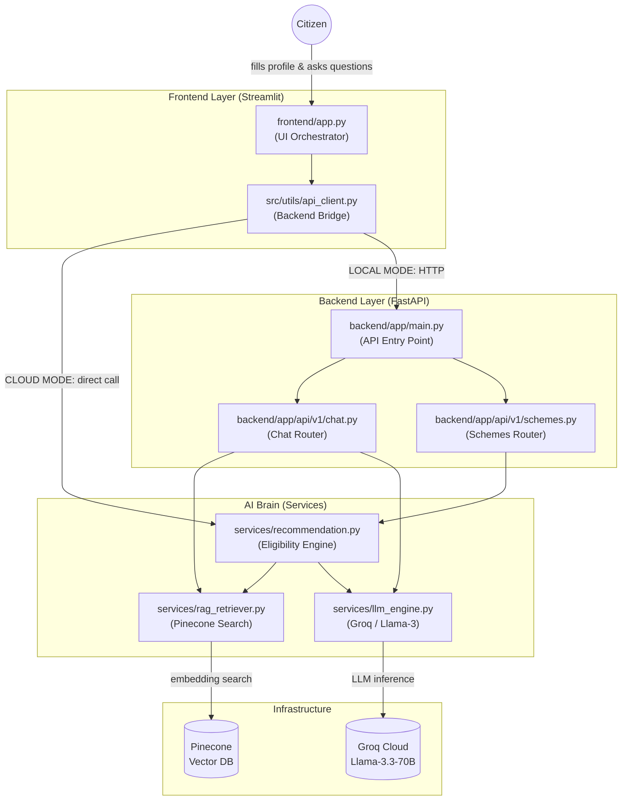

# S.A.R.A.L. — Complete Architectural Walkthrough

> **Scheme Access Retrieval Analysis Layer**
> A mentor-level guide to understanding how every piece of this codebase fits together.

---

## 1. The Big Picture

S.A.R.A.L. is an **AI-powered GovTech platform** that helps Indian citizens discover which government schemes they are eligible for. At the highest level, there are **three distinct layers**:



> [!NOTE]
> There are **two deployment modes**. In **CLOUD mode** (Streamlit Cloud), the frontend calls backend services directly as Python functions — no HTTP server needed. In **LOCAL mode**, a proper FastAPI server runs on `localhost:8000` and the frontend makes HTTP requests.

---

## 2. Directory Structure — Quick Map

| Directory / File | Layer | One-Line Role |
|---|---|---|
| [frontend/app.py](file:///c:/Users/BAPS/OneDrive%20-%20pdpu.ac.in/Documents/AI_LAB_NEW/frontend/app.py) | Frontend | The single Streamlit UI file — renders everything the user sees |
| [frontend/src/utils/api_client.py](file:///c:/Users/BAPS/OneDrive%20-%20pdpu.ac.in/Documents/AI_LAB_NEW/frontend/src/utils/api_client.py) | Frontend | The only bridge between UI and backend logic |
| [backend/app/main.py](file:///c:/Users/BAPS/OneDrive%20-%20pdpu.ac.in/Documents/AI_LAB_NEW/backend/app/main.py) | Backend | FastAPI app factory; registers all HTTP routers |
| [backend/app/api/v1/chat.py](file:///c:/Users/BAPS/OneDrive%20-%20pdpu.ac.in/Documents/AI_LAB_NEW/backend/app/api/v1/chat.py) | Backend API | Handles `POST /chat` HTTP requests |
| [backend/app/api/v1/schemes.py](file:///c:/Users/BAPS/OneDrive%20-%20pdpu.ac.in/Documents/AI_LAB_NEW/backend/app/api/v1/schemes.py) | Backend API | Handles `POST /recommend` HTTP requests |
| [backend/app/core/config.py](file:///c:/Users/BAPS/OneDrive%20-%20pdpu.ac.in/Documents/AI_LAB_NEW/backend/app/core/config.py) | Config | Loads API keys from [.env](file:///c:/Users/BAPS/OneDrive%20-%20pdpu.ac.in/Documents/AI_LAB_NEW/.env) or Streamlit secrets |
| [backend/app/models/dtos.py](file:///c:/Users/BAPS/OneDrive%20-%20pdpu.ac.in/Documents/AI_LAB_NEW/backend/app/models/dtos.py) | Models | Pydantic schemas for all request/response shapes |
| [backend/app/services/recommendation.py](file:///c:/Users/BAPS/OneDrive%20-%20pdpu.ac.in/Documents/AI_LAB_NEW/backend/app/services/recommendation.py) | AI Brain | Orchestrates the full eligibility-check pipeline |
| [backend/app/services/rag_retriever.py](file:///c:/Users/BAPS/OneDrive%20-%20pdpu.ac.in/Documents/AI_LAB_NEW/backend/app/services/rag_retriever.py) | AI Brain | Queries Pinecone vector database |
| [backend/app/services/llm_engine.py](file:///c:/Users/BAPS/OneDrive%20-%20pdpu.ac.in/Documents/AI_LAB_NEW/backend/app/services/llm_engine.py) | AI Brain | Sends prompts to Groq/Llama-3 and returns answers |
| [backend/scripts/ingest_pdfs.py](file:///c:/Users/BAPS/OneDrive%20-%20pdpu.ac.in/Documents/AI_LAB_NEW/backend/scripts/ingest_pdfs.py) | Ops | One-time script to process PDFs and load them into Pinecone |

---

## 3. Frontend Deep Dive

### [frontend/app.py](file:///c:/Users/BAPS/OneDrive%20-%20pdpu.ac.in/Documents/AI_LAB_NEW/frontend/app.py) — The UI Orchestrator

This is the **only file Streamlit runs**. Think of it as the conductor of an orchestra — it doesn't play the instruments itself, but it coordinates everything.

**Key responsibilities:**

1. **Path & Environment Setup** *(lines 7–28)*: Before any imports, it dynamically adds the project root to `sys.path`. This is what makes `from backend.app.services...` work on cloud. It also forces API keys from `st.secrets` into `os.environ` so libraries like LangChain can find them.

2. **Page Config & CSS** *(lines 34–111)*: Sets up the dark-mode GovTech UI with custom CSS injected via `st.markdown(..., unsafe_allow_html=True)`. The `.scheme-card` CSS class is what makes those green-badged scheme cards render correctly.

3. **Session State** *(lines 114–119)*: Acts as the app's memory between reruns. It stores `messages` (chat history), [recommendations](file:///c:/Users/BAPS/OneDrive%20-%20pdpu.ac.in/Documents/AI_LAB_NEW/frontend/src/utils/api_client.py#104-162) (last eligibility results), and `profile` (user's submitted form data).

4. **Sidebar Form** *(lines 122–197)*: All user inputs — age, state, occupation, income, caste, language — are captured in a single Streamlit form. On submit, it calls [get_recommendations()](file:///c:/Users/BAPS/OneDrive%20-%20pdpu.ac.in/Documents/AI_LAB_NEW/frontend/src/utils/api_client.py#104-162) from the API client.

5. **Results Rendering** *(lines 217–261)*: Filters the returned list to only [eligible](file:///c:/Users/BAPS/OneDrive%20-%20pdpu.ac.in/Documents/AI_LAB_NEW/backend/app/services/recommendation.py#87-105) schemes, then renders them in a **dynamic 3-column grid**. Each row creates a new `st.columns(3)` to prevent layout truncation.

6. **Chat Interface** *(lines 269–300)*: A standard chat loop. Renders conversation history, accepts new input, calls [get_chat_response()](file:///c:/Users/BAPS/OneDrive%20-%20pdpu.ac.in/Documents/AI_LAB_NEW/frontend/src/utils/api_client.py#27-102), and appends the AI's answer back to history.

> [!IMPORTANT]
> [app.py](file:///c:/Users/BAPS/OneDrive%20-%20pdpu.ac.in/Documents/AI_LAB_NEW/frontend/app.py) **never contains business logic**. It only collects user input, calls [api_client.py](file:///c:/Users/BAPS/OneDrive%20-%20pdpu.ac.in/Documents/AI_LAB_NEW/frontend/src/utils/api_client.py), and renders results. All intelligence lives in the backend services.

---

### [frontend/src/utils/api_client.py](file:///c:/Users/BAPS/OneDrive%20-%20pdpu.ac.in/Documents/AI_LAB_NEW/frontend/src/utils/api_client.py) — The Backend Bridge

This file is the **translation layer** between the UI and the AI engine. It contains two public functions:

- **[get_recommendations(profile: dict)](file:///c:/Users/BAPS/OneDrive%20-%20pdpu.ac.in/Documents/AI_LAB_NEW/frontend/src/utils/api_client.py#104-162)** — Takes the user's profile dictionary, turns it into a [UserProfile](file:///c:/Users/BAPS/OneDrive%20-%20pdpu.ac.in/Documents/AI_LAB_NEW/backend/app/models/dtos.py#9-17) Pydantic model, calls [RecommendationService](file:///c:/Users/BAPS/OneDrive%20-%20pdpu.ac.in/Documents/AI_LAB_NEW/backend/app/services/recommendation.py#78-310), and returns a dict with a [recommendations](file:///c:/Users/BAPS/OneDrive%20-%20pdpu.ac.in/Documents/AI_LAB_NEW/frontend/src/utils/api_client.py#104-162) list.
- **[get_chat_response(query, profile, history)](file:///c:/Users/BAPS/OneDrive%20-%20pdpu.ac.in/Documents/AI_LAB_NEW/frontend/src/utils/api_client.py#27-102)** — Takes a question + context, calls the RAG + LLM pipeline, and returns a dict with an [answer](file:///c:/Users/BAPS/OneDrive%20-%20pdpu.ac.in/Documents/AI_LAB_NEW/backend/app/services/llm_engine.py#42-82) string.

**The dual-mode trick** is the most important design decision here:

```python
DEPLOYMENT_ENV = os.getenv("DEPLOYMENT_ENV", "LOCAL")

if DEPLOYMENT_ENV == "CLOUD":
    # Direct Python function call — no network hop
    from backend.app.services.recommendation import RecommendationService
    ...
else:
    # HTTP POST to localhost:8000
    response = requests.post(url, json=profile)
```

This single `if/else` block is why the same codebase works both locally (with FastAPI) and on Streamlit Cloud (without running a separate server).

---

## 4. Backend Deep Dive

### [backend/app/main.py](file:///c:/Users/BAPS/OneDrive%20-%20pdpu.ac.in/Documents/AI_LAB_NEW/backend/app/main.py) — The API Entry Point

This is the FastAPI application factory. It's intentionally minimal:

```python
app = FastAPI(title="BharatScheme-AI")
app.include_router(chat_router, prefix="/api/v1")
app.include_router(schemes_router, prefix="/api/v1")
```

It just wires up routers and starts `uvicorn`. No business logic lives here.

---

### [backend/app/api/v1/chat.py](file:///c:/Users/BAPS/OneDrive%20-%20pdpu.ac.in/Documents/AI_LAB_NEW/backend/app/api/v1/chat.py) — The Chat Endpoint

Handles `POST /api/v1/chat`. On each request it:
1. Creates a fresh [RAGService](file:///c:/Users/BAPS/OneDrive%20-%20pdpu.ac.in/Documents/AI_LAB_NEW/backend/app/services/rag_retriever.py#27-72) and [LLMEngine](file:///c:/Users/BAPS/OneDrive%20-%20pdpu.ac.in/Documents/AI_LAB_NEW/backend/app/services/llm_engine.py#26-92) instance
2. Calls `rag.get_context(query)` to fetch relevant document chunks
3. Calls `llm.generate_answer(query, context)` to get the AI's response
4. Returns a [ChatResponse](file:///c:/Users/BAPS/OneDrive%20-%20pdpu.ac.in/Documents/AI_LAB_NEW/backend/app/models/dtos.py#26-30) with the answer

---

### [backend/app/models/dtos.py](file:///c:/Users/BAPS/OneDrive%20-%20pdpu.ac.in/Documents/AI_LAB_NEW/backend/app/models/dtos.py) — The Data Contracts

Three Pydantic models define the strict shape of all data flowing through the system:

| Model | Purpose |
|---|---|
| [UserProfile](file:///c:/Users/BAPS/OneDrive%20-%20pdpu.ac.in/Documents/AI_LAB_NEW/backend/app/models/dtos.py#9-17) | A citizen's demographic data (age, state, income, caste, occupation, language) |
| [ChatRequest](file:///c:/Users/BAPS/OneDrive%20-%20pdpu.ac.in/Documents/AI_LAB_NEW/backend/app/models/dtos.py#19-24) | Incoming chat payload: query + optional profile + conversation history |
| [ChatResponse](file:///c:/Users/BAPS/OneDrive%20-%20pdpu.ac.in/Documents/AI_LAB_NEW/backend/app/models/dtos.py#26-30) | Outgoing payload: answer string + source document list |

> [!TIP]
> Pydantic models are your first line of defence. If [app.py](file:///c:/Users/BAPS/OneDrive%20-%20pdpu.ac.in/Documents/AI_LAB_NEW/frontend/app.py) sends `income` as an integer but the model expects a [str](file:///c:/Users/BAPS/OneDrive%20-%20pdpu.ac.in/Documents/AI_LAB_NEW/backend/app/services/recommendation.py#170-178), Pydantic will raise a validation error *before* any AI logic runs — making bugs much easier to trace.

---

### [backend/app/core/config.py](file:///c:/Users/BAPS/OneDrive%20-%20pdpu.ac.in/Documents/AI_LAB_NEW/backend/app/core/config.py) — The Secret Manager

This is a **critical infrastructure file** that ensures API keys are available regardless of deployment environment. The [Settings](file:///c:/Users/BAPS/OneDrive%20-%20pdpu.ac.in/Documents/AI_LAB_NEW/backend/app/core/config.py#23-45) class:

1. Tries `os.getenv()` first (reads from [.env](file:///c:/Users/BAPS/OneDrive%20-%20pdpu.ac.in/Documents/AI_LAB_NEW/.env) via `python-dotenv`)
2. Falls back to `st.secrets` (Streamlit Cloud secret store)
3. Injects the value back into `os.environ` so LangChain's library internals can find it automatically

The global singleton `settings = Settings()` is imported by [rag_retriever.py](file:///c:/Users/BAPS/OneDrive%20-%20pdpu.ac.in/Documents/AI_LAB_NEW/backend/app/services/rag_retriever.py) and [llm_engine.py](file:///c:/Users/BAPS/OneDrive%20-%20pdpu.ac.in/Documents/AI_LAB_NEW/backend/app/services/llm_engine.py).

---

## 5. The AI Brain — Services Layer

This is the most important layer. Three services work together in a pipeline.

### Service 1: [rag_retriever.py](file:///c:/Users/BAPS/OneDrive%20-%20pdpu.ac.in/Documents/AI_LAB_NEW/backend/app/services/rag_retriever.py) — The Librarian

Responsible for fetching relevant text chunks from Pinecone. It has two public methods:

- **[get_context(query, k=5)](file:///c:/Users/BAPS/OneDrive%20-%20pdpu.ac.in/Documents/AI_LAB_NEW/backend/app/services/rag_retriever.py#47-60)** — Returns a single joined string of the top-k most relevant chunks. Used by the **chat** pipeline.
- **[get_raw_docs(query, k=50)](file:///c:/Users/BAPS/OneDrive%20-%20pdpu.ac.in/Documents/AI_LAB_NEW/backend/app/services/rag_retriever.py#61-72)** — Returns raw `Document` objects with metadata attached. Used by the **recommendation** pipeline so metadata can be inspected for state-level filtering.

It also implements **query expansion**: if the user asks about "documents" or "proof", extra keywords like `"aadhaar card income certificate"` are automatically appended to improve retrieval recall.

The underlying embedding model is `sentence-transformers/all-MiniLM-L6-v2` (HuggingFace), which converts text to dense vectors for semantic similarity search against Pinecone.

---

### Service 2: [llm_engine.py](file:///c:/Users/BAPS/OneDrive%20-%20pdpu.ac.in/Documents/AI_LAB_NEW/backend/app/services/llm_engine.py) — The Analyst

This wraps the **Groq / Llama-3.3-70B** model using LangChain's chain syntax:

```python
self.chain = self.prompt | self.llm | self.parser
```

It has two public methods:
- **[generate_answer(query, context, language, history)](file:///c:/Users/BAPS/OneDrive%20-%20pdpu.ac.in/Documents/AI_LAB_NEW/backend/app/services/llm_engine.py#42-82)** — Uses the default RAG prompt template. Injects context, query, optional language instruction, and last 10 messages of history into the `_TEMPLATE` and invokes the chain.
- **[generate_raw(prompt)](file:///c:/Users/BAPS/OneDrive%20-%20pdpu.ac.in/Documents/AI_LAB_NEW/backend/app/services/llm_engine.py#83-92)** — Bypasses the template entirely. Used by [recommendation.py](file:///c:/Users/BAPS/OneDrive%20-%20pdpu.ac.in/Documents/AI_LAB_NEW/backend/app/services/recommendation.py) which builds its own detailed eligibility prompt.

---

### Service 3: [recommendation.py](file:///c:/Users/BAPS/OneDrive%20-%20pdpu.ac.in/Documents/AI_LAB_NEW/backend/app/services/recommendation.py) — The Eligibility Engine

This is the **heart of S.A.R.A.L.**. It orchestrates a sophisticated 3-stage pipeline:

**Stage 1 — Multi-Vector Retrieval** ([_retrieve_documents](file:///c:/Users/BAPS/OneDrive%20-%20pdpu.ac.in/Documents/AI_LAB_NEW/backend/app/services/recommendation.py#106-147)):
Three parallel semantic queries are fired at Pinecone to maximize recall:

| Strategy | Query Style | Goal |
|---|---|---|
| A: Semantic | `"Government schemes for Farmer in Gujarat..."` | Nuanced conceptual match |
| B: Keyword | `"Farmer schemes state:Gujarat income:..."` | Structured tag match |
| C: National | `"Central government Farmer schemes scholarships..."` | Catch-all for PM/central schemes |

Results from all three are merged and deduplicated by comparing the first 200 characters of each document's content.

**Stage 2 — Strict Metadata Filtering** ([_filter_docs](file:///c:/Users/BAPS/OneDrive%20-%20pdpu.ac.in/Documents/AI_LAB_NEW/backend/app/services/recommendation.py#148-169)):
Before sending anything to the LLM, each document's [state](file:///c:/Users/BAPS/OneDrive%20-%20pdpu.ac.in/Documents/AI_LAB_NEW/backend/app/services/recommendation.py#179-205) metadata tag is checked against the user's state. The rules are:

- `state == "Central" / "India" / "Pan India"` → Keep (universal scheme)
- `state == None / missing` → Keep (assume open to all)
- `state == "Gujarat"` and user is from Gujarat → Keep
- `state == "Maharashtra"` and user is from Gujarat → Drop

**Stage 3 — LLM Verdict** ([_generate_verdicts](file:///c:/Users/BAPS/OneDrive%20-%20pdpu.ac.in/Documents/AI_LAB_NEW/backend/app/services/recommendation.py#206-250)):
The top 15 filtered documents are assembled into a context block and sent to the LLM with the detailed `_ELIGIBILITY_PROMPT`. The prompt includes:

- Strict income comparison logic (Step 1/2/3 rules)
- Caste negative constraints (don't recommend SC/ST schemes to OBC users)
- Language instructions (translate `reason` field to Hindi if needed)
- An instruction to return **only a raw JSON array** — no prose

The raw LLM response is then parsed by [_parse_response()](file:///c:/Users/BAPS/OneDrive%20-%20pdpu.ac.in/Documents/AI_LAB_NEW/backend/app/services/recommendation.py#283-310), which tries direct `json.loads()` first, then uses a bracket-counting algorithm to extract JSON from any extra text the LLM might have generated.

---

## 6. End-to-End Data Flow — "Run Eligibility Check"

Here is every step that happens when a user fills in the form and clicks the submit button:

```
User clicks "Run Eligibility Check" in sidebar
        │
        ▼
[app.py] Builds profile_data dict {age, state, occupation, income, caste, language}
        │
        ▼
[app.py] Calls get_recommendations(profile_data)
        │
        ▼
[api_client.py] Detects DEPLOYMENT_ENV == "CLOUD"
        │  → Instantiates RecommendationService() directly (no HTTP)
        │
        ▼
[recommendation.py] get_eligible_schemes(UserProfile)
        │
        ├─▶ Strategy A query ──┐
        ├─▶ Strategy B query ──┼──▶ [rag_retriever.py] get_raw_docs()
        └─▶ Strategy C query ──┘         │
                                          ▼
                                [Pinecone Vector DB]
                                 Embedding similarity search
                                 Returns raw Document objects
                                          │
        ◀─────────────────────────────────┘
        │
        ▼
[recommendation.py] _filter_docs()
   Drops documents whose state metadata doesn't match user's state
        │
        ▼
[recommendation.py] _generate_verdicts()
   Assembles context string from top 15 documents
   Builds eligibility prompt with user profile + income rules + caste logic
        │
        ▼
[llm_engine.py] generate_raw(full_prompt)
        │
        ▼
[Groq Cloud] Llama-3.3-70B processes the prompt
   Returns JSON array: [{scheme_name, eligibility_status, reason}, ...]
        │
        ▼
[recommendation.py] _parse_response()
   Extracts and validates JSON array from LLM output
        │
        ▼
[api_client.py] Returns {"recommendations": [...list of dicts...]}
        │
        ▼
[app.py] Filters to only "Eligible" status items
   Renders 3-column card grid with scheme names + reasons
        │
        ▼
User sees their personalised scheme recommendations
```

---

## 7. Supporting Files

### [backend/scripts/ingest_pdfs.py](file:///c:/Users/BAPS/OneDrive%20-%20pdpu.ac.in/Documents/AI_LAB_NEW/backend/scripts/ingest_pdfs.py) — The Data Loader

This is an **ops/maintenance script**, not part of the live application. You run it manually (or on a schedule) to:
1. Read government PDF files from `data/raw_pdfs/`
2. Parse and chunk the text using strategies in `pdf_parser.py`
3. Generate embeddings via HuggingFace
4. Upload the embedded chunks to Pinecone with metadata (scheme name, state, etc.)

> [!WARNING]
> If this script is never run — or run incorrectly — the Pinecone vector database will be empty and **the AI will have nothing to retrieve**. This is the most common reason the system returns "No Schemes Found."

### `backend/app/core/config.py` + `.env` — Secrets

The `.env` file at the project root holds three critical secrets:
- `GROQ_API_KEY` — Access to Groq/Llama-3
- `PINECONE_API_KEY` — Access to the vector database
- `PINECONE_INDEX_NAME` — Which Pinecone index to use (default: `bharat-schemes`)

Never commit `.env` to Git — it's in `.gitignore`.

### `docker-compose.yml` — Local Orchestration

Runs the entire stack locally with a single command (`docker-compose up`), starting the backend FastAPI server and frontend together with correct networking.

---

## 8. Key Architectural Patterns to Remember

| Pattern | Where it appears | Why it matters |
|---|---|---|
| **Dual-mode deployment** | `api_client.py` | Same code runs locally (HTTP) and on cloud (direct function call) |
| **Service layer isolation** | `backend/app/services/` | Business logic is completely separate from API/HTTP concerns |
| **Multi-strategy RAG** | `recommendation.py` | 3 queries instead of 1 dramatically increases relevant document recall |
| **Metadata pre-filtering** | `recommendation.py._filter_docs` | Reduces LLM token usage and hallucination by removing irrelevant state docs |
| **Two LLM methods** | `llm_engine.py` | `generate_answer` (templated) for chat, `generate_raw` (untemplated) for recommendations |
| **Pydantic DTOs** | `models/dtos.py` | Validates data shape at the boundary between UI and backend |
| **Secret injection chain** | `core/config.py` | Works in `.env`, in Docker, AND on Streamlit Cloud without code changes |

---

## 9. Ops Scripts — The Database Maintenance Toolkit

All scripts live in `backend/scripts/` and are run **manually from the project root** using `python -m backend.scripts.<script_name>`. They are **never called by the live application** — they are your maintenance toolbox.

### `ingest_pdfs.py` — The Knowledge Loader (Run this first)

This is the **most critical ops script**. Without it, Pinecone is empty and the AI has nothing to retrieve. Here's what it does step by step:

1. **Discovery** — Walks `data/raw_pdfs/` recursively. Supports `.pdf`, `.csv`, `.json`, `.txt` files.
2. **Smart State Tagging** — This is the clever part:
   ```
   data/raw_pdfs/
   ├── scheme_national_pm.pdf  → tagged state = "Central"
   ├── Gujarat/
   │   └── scheme_gujarat.pdf  → tagged state = "Gujarat"
   └── Maharashtra/
       └── scheme_maha.pdf     → tagged state = "Maharashtra"
   ```
   The subfolder name **becomes the state tag** in Pinecone metadata. Files at the root level default to `"Central"`. This is exactly what `_filter_docs()` in `recommendation.py` reads at query time.

3. **Chunking** — Uses `RecursiveCharacterTextSplitter` with `chunk_size=1000` and `chunk_overlap=200`. Overlap ensures context isn't lost at chunk boundaries.
4. **Upload** — Embeds each chunk with `all-MiniLM-L6-v2` and upserts to Pinecone **file-by-file** (so a failure mid-way doesn't lose everything already uploaded).

> [!IMPORTANT]
> The folder structure inside `data/raw_pdfs/` **directly controls** which users see which schemes. Place a PDF in the `Gujarat/` subfolder and it will only be shown to Gujarat users. Place it at the root and it's shown to everyone.

---

### `check_metadata.py` — The Database Inspector

Run this after ingestion to **verify what's actually in Pinecone**. It performs a sample search for `"farming scheme"` and prints the `state` tag and `source_file` for each returned document. This is your first debugging tool when recommendations look wrong.

```
Doc 1: pm_kisan.pdf
    State Tag: 'Central'
Doc 2: gujarat_farmer_aid.pdf
    State Tag: 'Gujarat'
```

---

### `debug_pinecone.py` — The Full RAG Diagnostic

A more comprehensive diagnostic that runs **three sequential tests**:

| Test | What it does | What to look for |
|---|---|---|
| **Test 1** | Dummy search (`"."`) to check if the index has any vectors at all | If empty → run `ingest_pdfs.py` |
| **Test 2** | Targeted search (e.g., `"scholarship for students in andhra pradesh"`) | Are scores above 0.7? Are state tags correct? |
| **Test 3** | Keyword match (e.g., a specific scheme name) | Can Pinecone find a scheme you know exists? |

> [!TIP]
> Run `debug_pinecone.py` any time recommendations feel wrong or the system returns "No Schemes Found". It's the fastest way to diagnose whether the problem is in the **database** (empty or mis-tagged) vs. the **LLM** (prompt issue).

---

### `reset_db.py` — The Nuclear Option

Wipes the Pinecone index entirely. Use only when you want to re-ingest everything from scratch. Run `ingest_pdfs.py` immediately after.

---

### `test_groq.py` — The Connection Tester

A quick sanity check to verify your `GROQ_API_KEY` is valid and the Groq endpoint is reachable. Run this first when setting up on a new machine.

---

## 10. Tests — Your Safety Net

### `tests/test_config_hybrid.py`

The only automated test in the main `tests/` folder. It verifies the **most failure-prone part** of the configuration system: that secrets loaded from `.env` are correctly injected into `os.environ` for LangChain to consume.

```python
# The two things it checks:
assert bool(settings.PINECONE_API_KEY)          # Key was loaded from .env
assert os.environ.get("PINECONE_API_KEY") == ..  # Key was injected into os.environ
```

**Why this test is important**: LangChain's internal Pinecone and Groq clients read keys from `os.environ`, NOT from a passed object. If `config.py` loads the key but doesn't inject it into `os.environ`, LangChain silently fails with a cryptic authentication error. This test catches that exact bug.

**How to run it:**
```bash
# From project root
python tests/test_config_hybrid.py
# OR with pytest
pytest tests/test_config_hybrid.py -v
```

### `test_config.py` / `test_rag.py` / `test_full_rag.py` (project root)

These are **integration smoke tests** at the project root. They test the full RAG pipeline end-to-end — not just configuration. Run them after any change to `rag_retriever.py` or `llm_engine.py` to make sure the pipeline is still healthy.

---

## 11. Dependency Stack — What Each Package Does

From `requirements.txt`:

| Package | Role in S.A.R.A.L. |
|---|---|
| `streamlit` | Powers the entire frontend UI |
| `fastapi` + `uvicorn` | Runs the backend HTTP API server in LOCAL mode |
| `pydantic` | Validates all request/response data shapes (DTOs) |
| `python-dotenv` | Loads `.env` file into `os.environ` |
| `langchain` | Orchestration framework — chains prompts, parsers, and LLMs together |
| `langchain-groq` | LangChain adapter for the Groq API (Llama-3.3-70B) |
| `langchain-pinecone` | LangChain adapter for Pinecone vector store |
| `langchain-huggingface` | Runs the `all-MiniLM-L6-v2` embedding model locally |
| `pinecone` | Low-level Pinecone SDK (used by `langchain-pinecone` internally) |
| `groq` | Low-level Groq SDK (used by `langchain-groq` internally) |
| `requests` | Used in `api_client.py` for LOCAL mode HTTP calls |

> [!NOTE]
> There are **two** `requirements.txt` files: one at the project root (for the frontend / Streamlit Cloud deployment) and one inside `backend/` (for the FastAPI server). They overlap significantly — the root one is the authoritative one for cloud deployment.

---

## 12. How to Spin Up the Project (Quick Reference)

```bash
# 1. Install dependencies
pip install -r requirements.txt

# 2. Set up your secrets
cp .env.example .env           # then fill in your real API keys

# 3. Verify your secrets load correctly
python tests/test_config_hybrid.py

# 4. Ingest your government PDFs (one-time setup)
python -m backend.scripts.ingest_pdfs

# 5. Verify what's in Pinecone
python -m backend.scripts.check_metadata

# 6. Run the app
streamlit run frontend/app.py

# --- OR locally with the full FastAPI backend ---
uvicorn backend.app.main:app --reload   # Terminal 1
streamlit run frontend/app.py           # Terminal 2
```
